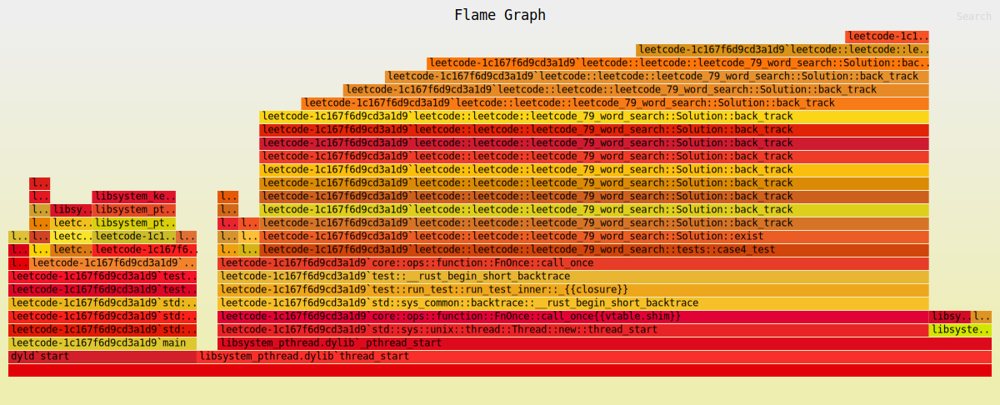

## cpp + rust Solution for leetcode online judge

#### cpp dependency

- gtest and google-benchmark
  - and every solution should contain with at least all leetcode test case
  - maybe contain benchmarks for my implementation and others'

#### rust dependency

- rand
- tokio together with syn quote ...

- recent learning

